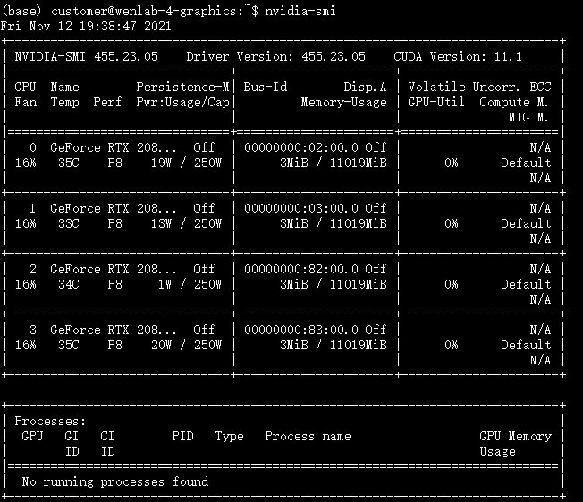

# Linux进程管理

## 清除Terminal界面

```md
clear
```

## 显示正在运行的CPU进程

```md
htop
```


## 显示正在运行的GPU进程

显示正在运行的GPU进程

```md
nvidia-smi
```



## 清理进程

```linux
kill -9 PID
```

其中`PID` 是你的进程编号

# 文件操作

## 统计文件夹下面文件个数

长列表输出该目录下文件信息(注意这里的文件是指目录、链接、设备文件等)，每一行对应一个文件或目录

```linux
ls -l # 查看详细信息
ls -a #查看隐藏文件
ls -la #同时具备上述两者特点
```

统计当前目录下文件的个数包括子目录

```linux
ls -lR
```
查看文件中内容

```linux
cat
```


## 删除文件

- 直接删除

  ```python
  rm filename
  ```

- 删除前提示

  ```pytho
  rm -i filename
  ```

  

- 强制删除

  ```py
  rm -f filename
  ```

  

- 递归删除

  ```Linux
  rm -rf /dir
  ```

## 删除文件夹

- 删除名为`Mydocuments`的空文件夹

```py
rmdir Mydocuments
```

如果文件夹不是空的，会提示 `rmdir: failed to remove ‘MyDocuments’: Directory not empty`

- 使用`rm`递归删除来删除，会删除所有目录和子目录，不提示

  ```py
  rm -rf dir1 dir2 dir3
  ```

  

- 删除所有空目录

  ```py
  find . -type d -empty -delete
  ```

  `-empty`只对空目录进行限制

  `-delete`删除包括子目录在内的所有空目录

# 文件创建

`echo`文字输入

```linux
echo xxx > y.txt  # 把 xxx 内容放到 y.txt 文件中，如果没有这个文件则创建这个文件，新存放的内容会替换原有文件的内容
```

