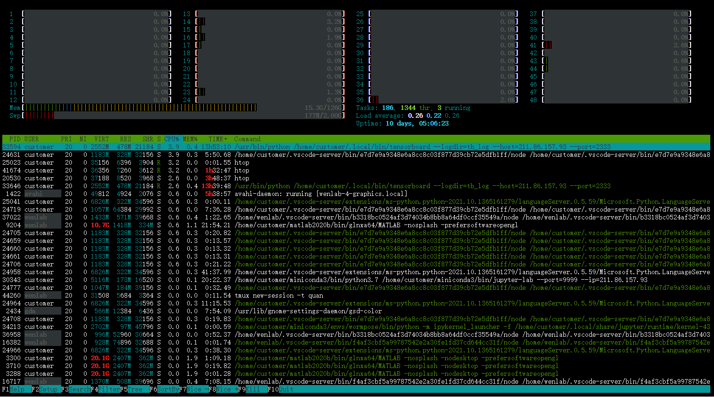

# Linux进程管理

## 清除Terminal界面

```md
clear
```

## 显示正在运行的CPU进程

```md
htop
```




## 显示正在运行的GPU进程

显示正在运行的GPU进程

```md
nvidia-smi
```


## 清理进程

```linux
kill -9 PID
```

其中`PID` 是你的进程编号

# 文件操作

## 统计文件夹下面文件个数

长列表输出该目录下文件信息(注意这里的文件是指目录、链接、设备文件等)，每一行对应一个文件或目录

```linux
ls -l
```

统计当前目录下文件的个数包括子目录

```linux
ls -lR
```
<!--more-->
