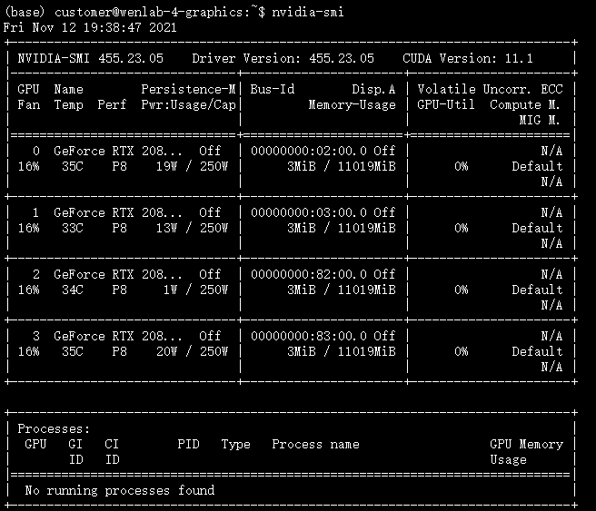
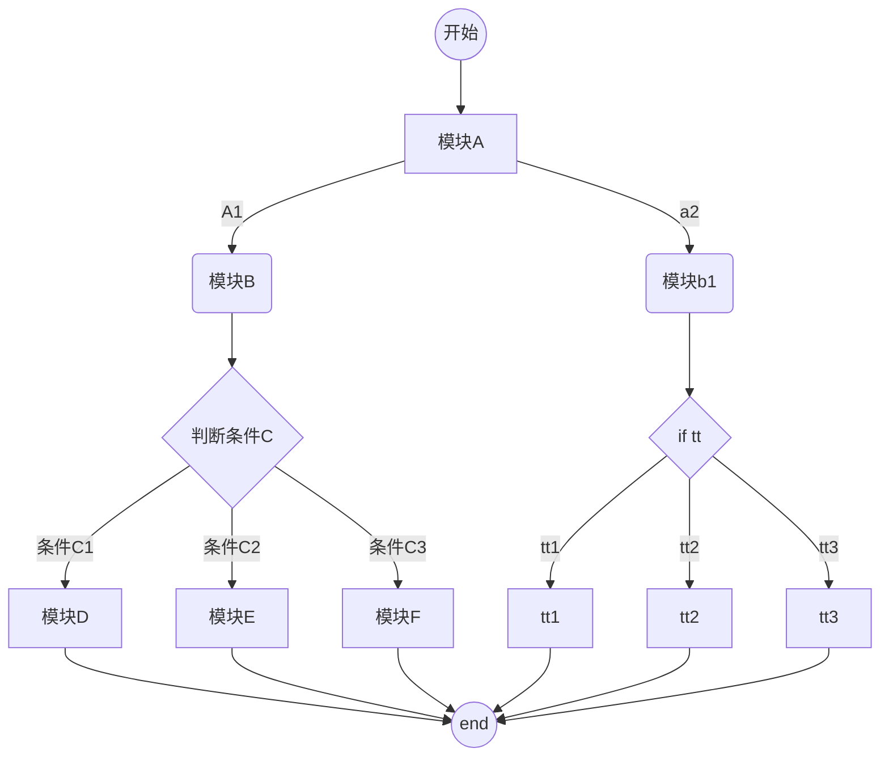
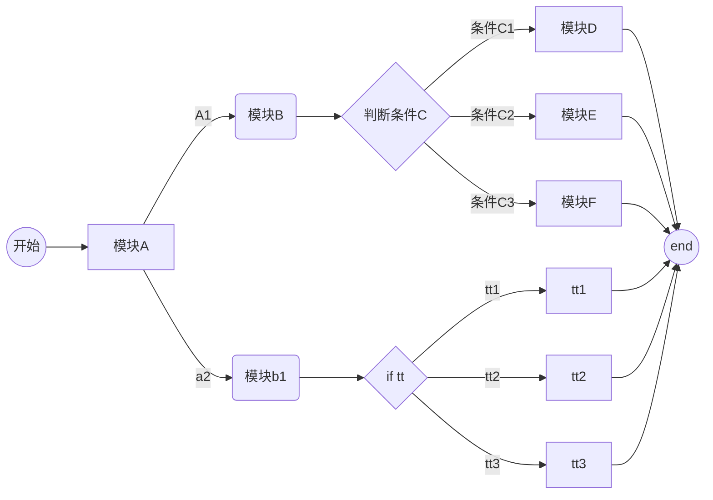
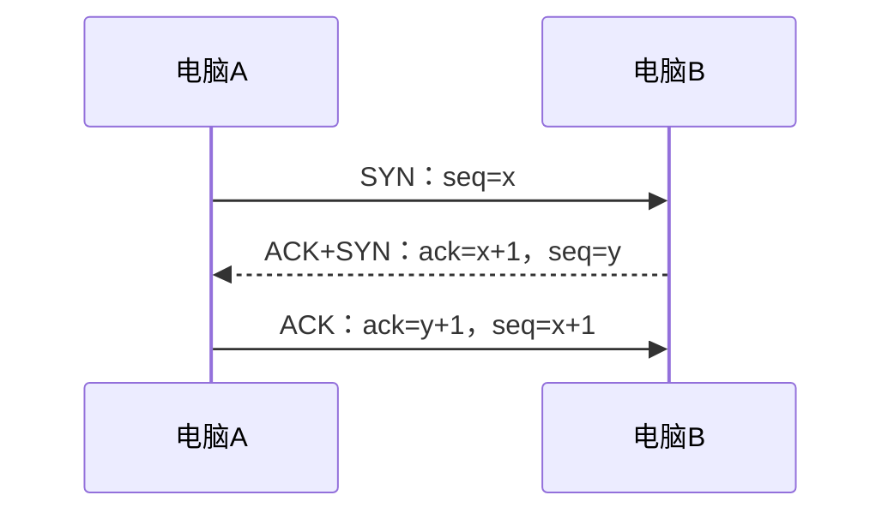

[Typora下载](https://www.typora.io/#windows)

# 小功能

## 启用预览功能

直接在文章中插入即可，此代码一下的需要点击 阅读更多 才能此代码下面的内容

```md
<!--more-->
```

## 文章内部锚点跳转

这个方式是由John Tsai给出的，分成两步：

- 定义一个锚(id)：

```md
<span id="jump">跳转到的地方</span>
```

- 使用markdown语法：

```md
[点击跳转](#jump)
```

## 自己写的文章的跳转

```md
[名称](/forder-to-you-file)
```

例子:

- 跳转到[我的第一篇博客](/post/Firstblog.html)

  ```md
    [我的第一篇博客](/post/Firstblog.html)
  ```

- 跳转到[我的笔记](/mynotes/math/common_dstribute.html)
    在内部的位置是`myblog/source/mynotes/math/common_dstribute.html`

    ```md
    [我的笔记](/mynotes/math/common_dstribute.html)
    ```

## 链接跳转

```md
[名称](链接)
```

# 如何插入图片

HEXO生成静态界面时，同一篇文章会在多处页面生成，例如首页、文章详情页等，而不同页面与图片的相对位置是不一样的，而该方式hexo不会自动处理图片引用

Vscode和Hexo在网页渲染的图片位置是不一样的试用好久才发现如下的格式两者都会显示图片

在`source`中新建一个`images`目录用于存放图片，将图片放在该目录下，示例:

## 例1. 如在任意`_post`目录下的文章中引用

`myblog/source/images/notecover/Firstblog.png`的这张图片
想引用的时候VScode和网页都能看到要用如下格式

```md

或者

```

如果使用格式以下格式

### 网页端看不到的格式|VScode能看到

```md


```

### VsCode看不到的格式|网页端能看到

```md

```

### 网页端和VsCode都看不到的格式

```md


```

## 例2.引用同级目录的同名文件夹下的图片

`myblog/source/_post/Linux常用命令.md`文件中插入`myblog/source/_post/Linux常用命令/cup进程.png`的这张图片想引用的时候VScode和网页都能看到要用如下格式

```md


```

下面的方法只能在文章`Linux常用命令.md`中插入同文件夹路径下的图片`Linux常用命令/tupian.png`

```md

```

### VScode能看到的格式|网页端看不到

```md

```

### 网页端能看到的格式|VScode看不到

```md


```

### 网页端和VScode都不能看到

```md


```

<!--more-->

# VSCode快捷键

## 快速修复

`Windows` 上是 `Ctrl + .`


# 画图

流程图、时序图、甘特图。画图都是用代码形式输入的，所以，都是以代码块形式来输入。画图引用的是mermai代码模块

## 流程图

> - `graph` 是指画流程图，`TD`表示竖版,`LR`表示横版
> - 双括号`(( ))`表示圆圈; `[ ]`表示圆角矩形; `/ /`表示菱形
> - `-->`表示箭头连接线

语法样例：

````md

````


自动生成的竖版效果如下：


自动生成的横版效果如下：



## 时序图

`sequenceDiagram`表示时序图

语法示例:

````md

````


## 甘特图

`gantt`表示甘特图

语法示例：

````md

````


## 图表

