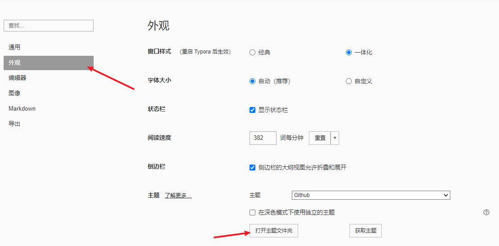
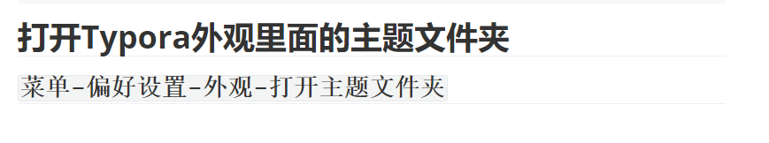
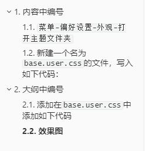

# 内容中编号

打开Typora外观里面的主题文件夹

## `菜单-偏好设置-外观-打开主题文件夹`




## 新建一个名为`base.user.css`的文件，写入如下代码：

```css
#write {
    counter-reset: h1
}

h1 {
    counter-reset: h2
}

h2 {
    counter-reset: h3
}

h3 {
    counter-reset: h4
}

h4 {
    counter-reset: h5
}

h5 {
    counter-reset: h6
}

#write h1:before {
    counter-increment: h1;
    content: counter(h1) " "
}

#write h2:before {
    counter-increment: h2;
    content: counter(h1) "." counter(h2) " "
}

#write h3:before,
h3.md-focus.md-heading:before {
    counter-increment: h3;
    content: counter(h1) "." counter(h2) "." counter(h3) " "
}

#write h4:before,
h4.md-focus.md-heading:before {
    counter-increment: h4;
    content: counter(h1) "." counter(h2) "." counter(h3) "." counter(h4) " "
}

#write h5:before,
h5.md-focus.md-heading:before {
    counter-increment: h5;
    content: counter(h1) "." counter(h2) "." counter(h3) "." counter(h4) "." counter(h5) " "
}

#write h6:before,
h6.md-focus.md-heading:before {
    counter-increment: h6;
    content: counter(h1) "." counter(h2) "." counter(h3) "." counter(h4) "." counter(h5) "." counter(h6) " "
}

#write > h3.md-focus:before,
#write > h4.md-focus:before,
#write > h5.md-focus:before,
#write > h6.md-focus:before,
h3.md-focus:before,
h4.md-focus:before,
h5.md-focus:before,
h6.md-focus:before {
    color: inherit;
    border: inherit;
    border-radius: inherit;
    position: inherit;
    left: initial;
    float: none;
    top: initial;
    font-size: inherit;
    padding-left: inherit;
    padding-right: inherit;
    vertical-align: inherit;
    font-weight: inherit;
    line-height: inherit;
}
```

上边部分是左边的标题栏，下面部分是正文的标题

这是没有添加前：



添加以后：


自动添加好序号了

# 大纲中编号

## 添加在`base.user.css`中添加如下代码

```css
.sidebar-content {
    counter-reset: h1
}

.outline-h1 {
    counter-reset: h2
}

.outline-h2 {
    counter-reset: h3
}

.outline-h3 {
    counter-reset: h4
}

.outline-h1>.outline-item>.outline-label:before {
    counter-increment: h1;
    content: counter(h1) ". "
}

.outline-h2>.outline-item>.outline-label:before {
    counter-increment: h2;
    content: counter(h1) "." counter(h2) ". "
}

.outline-h3>.outline-item>.outline-label:before {
    counter-increment: h3;
    content: counter(h1) "." counter(h2) "." counter(h3) ". "
}
```

重启Typora

## 效果图



# 完整代码

## 代码

```css
#write {
    counter-reset: h1
}

h1 {
    counter-reset: h2
}

h2 {
    counter-reset: h3
}

h3 {
    counter-reset: h4
}

h4 {
    counter-reset: h5
}

h5 {
    counter-reset: h6
}

#write h1:before {
    counter-increment: h1;
    content: counter(h1) "."
}

#write h2:before {
    counter-increment: h2;
    content: counter(h1) "." counter(h2) " "
}

#write h3:before,
h3.md-focus.md-heading:before {
    counter-increment: h3;
    content: counter(h1) "." counter(h2) "." counter(h3) " "
}

#write h4:before,
h4.md-focus.md-heading:before {
    counter-increment: h4;
    content: "(" counter(h4) ") "
}

#write h5:before,
h5.md-focus.md-heading:before {
    counter-increment: h5;
    content: counter(h5) ") "
}


.sidebar-content {
    counter-reset: h1
}

.outline-h1 {
    counter-reset: h2
}

.outline-h2 {
    counter-reset: h3
}

.outline-h3 {
    counter-reset: h4
}

.outline-h1>.outline-item>.outline-label:before {
    counter-increment: h1;
    content: counter(h1) ". "
}

.outline-h2>.outline-item>.outline-label:before {
    counter-increment: h2;
    content: counter(h1) "." counter(h2) ". "
}

.outline-h3>.outline-item>.outline-label:before {
    counter-increment: h3;
    content: counter(h1) "." counter(h2) "." counter(h3) ". "
}

.outline-h4>.outline-item>.outline-label:before {
    counter-increment: h4;
    content: "(" counter(h4) ") "
}

.outline-h5>.outline-item>.outline-label:before {
    counter-increment: h5;
    content: counter(h5) ") "
}

#write > h3.md-focus:before,
#write > h4.md-focus:before,
#write > h5.md-focus:before,
#write > h6.md-focus:before,
h3.md-focus:before,
h4.md-focus:before,
h5.md-focus:before,
h6.md-focus:before {
    color: inherit;
    border: inherit;
    border-radius: inherit;
    position: inherit;
    left: initial;
    float: none;
    top: initial;
    font-size: inherit;
    padding-left: inherit;
    padding-right: inherit;
    vertical-align: inherit;
    font-weight: inherit;
    line-height: inherit;
}
```

## 效果图

### 三级标题`###`

#### 四级标题`####`

##### 五级标题`#####`


参考链接：

​	[[Markdown][typora]如何让markdown自动显示序号](https://blog.csdn.net/lt6210925/article/details/109754804?utm_medium=distribute.pc_aggpage_search_result.none-task-blog-2~aggregatepage~first_rank_ecpm_v1~rank_v31_ecpm-1-109754804.pc_agg_new_rank&utm_term=markdown+%E5%BA%8F%E5%8F%B7&spm=1000.2123.3001.4430)

​	[Typora自动在大纲和编辑页面里显示编号](https://blog.csdn.net/qq_50806329/article/details/112845330)


<!--more-->

