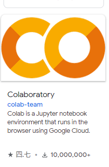
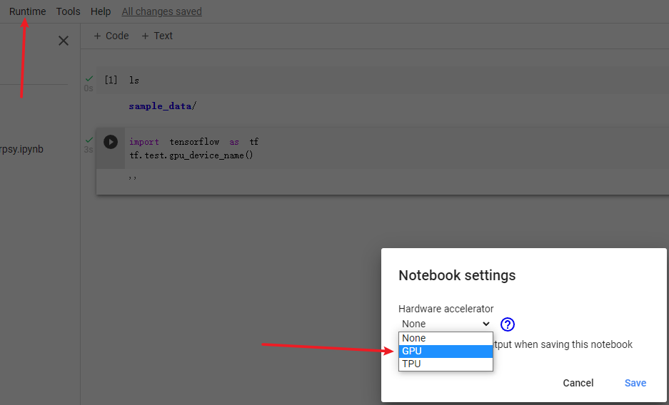
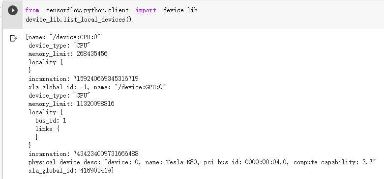
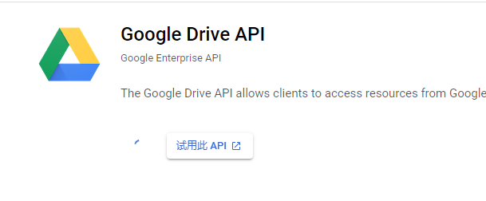

Google Colab(Colaboratory) 是一个研究项目，可免费使用。
旨在帮助传播机器学习培训和研究成果。它是一个 Jupyter 笔记本环境，不需要进行任何设置就可以使用，并且完全在云端运行

#  创建Colab

登录[GoogleDriver地址 https://drive.google.com/drive/my-drive](https://drive.google.com/drive/my-drive)

点击 `我的云端硬盘-更多-关联更多应用`


选择`Colaboratory`然后点击进去安装



安装Colaboratory插件,选择自己的Google账号，，选择与Google云端硬盘关联


新建Colaborator


链接到Google云端硬盘


允许授权


然后你的文件夹编程如下形式


查看是否能使用GPU

```python
import tensorflow as tf
tf.test.gpu_device_name()
```

如果结果为空，则不能使用GPU



选择`Runtime-GPU-Save`然后再重新运行代码

```python
import tensorflow as tf
tf.test.gpu_device_name()
```

如果结果为`/device:GPU:0`


使用`!/opt/bin/nvidia-smi`查看显存情况

```python
!/opt/bin/nvidia-smi
```


查看显卡内存使用上限

```python
from tensorflow.python.client import device_lib
device_lib.list_local_devices()
```



查看内存信息

```python
!cat /proc/meminfo
```

查看CPU信息

```python
!cat /proc/cupinfo
```

# 运行代码

## 挂载Google云盘

这一步很重要，Colab的运行原理实际上就是给你分配一台远程的带GPU的主机，所以它的原始路径不是你的谷歌云盘（也就是你的代码文件）所在的路径。所以第一步我们先要把谷歌云盘挂载带到那台远程主机上

```python
from google.colab import drive
drive.mount('/content/drive')
```

## 更改运行目录

```python
import os
os.chdir("/content/gdrive/My Drive/Colab Notebooks/Hashing")
```


# 重要的事情！！！

## Error 404: rate_limit_exceeded

Google 对应用的新用户登录频率设有上限。您可以稍后尝试重新登录，或者要求开发者 (drive-file-stream-feedback@google.com) 提高此应用的登录速率限制。

## 问题原因

出现403错误是因为gdrive使用的谷歌的API使用频率超限，这个API调用的凭据（Credentials）是集成在gdrive里的，使用的人太多了，就导致超限错误

所以为了解决这个错误，就需要把gdrive里内置的ClientId和ClientSecret替换为我们自己的。

## 申请API

- 登陆Google API服务

  [https://console.developers.google.com/apis/dashboard](https://console.developers.google.com/apis/dashboard)

  需要统一服务条款

- 创建项目


项目名称随意填写

- 启用Google Drive API

打开[https://console.developers.google.com/apis/library/drive.googleapis.com]( https://console.developers.google.com/apis/library/drive.googleapis.com)点击**启用**



- 创建凭据

  


参考链接

​		[如何使用Google Colab免费算力训练自己的模型](https://blog.csdn.net/qq122716072/article/details/106779195)

​		[如何正确使用Google Colab](https://www.cnblogs.com/think90/articles/13072937.html)


<!--more-->