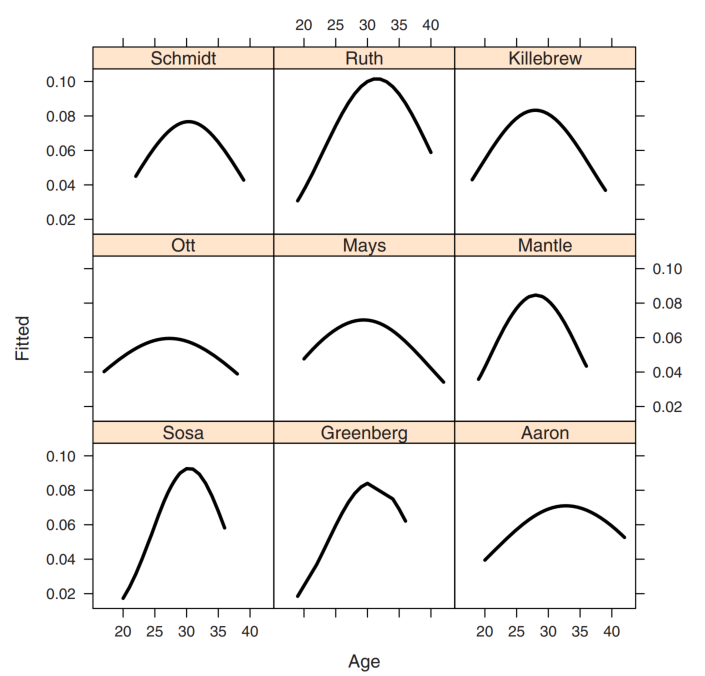

当所给先验分布中的超参数难以确定的时候，可以对超参数再给出一个先验（超先验）；若超先验中的参数还是难以确定，还可以给出第三个先验

>第一步：设
>
>​	$\Gamma_1 = \{\pi_1(\theta|\lambda): \pi_1的函数形式已知,\lambda\in D_1\},D_1$是超参数的取值范围

> 第二步：设$\lambda$为随机变量
>
> ​	$\Gamma_2=\{\pi_2(\lambda|\delta):\pi_2的函数形式已知,\delta\in D_2  \},D_2$是超参数$\delta$的取值范围

> 第三步：设$\delta$也是随机变量，有先验分布$\pi_3(\delta)$

任何一个先验都可以写成一个一般规范的先验：

对于两层先验：
$$
\pi(\theta) = \int_{D_1}\pi_1(\theta|\lambda)\pi_2(\lambda)d\lambda=\int_{D_1}\pi(\theta,\lambda)d\lambda
$$
其中：$\theta \sim \pi_1(\theta|\lambda),\lambda\sim \pi_2(\lambda)$

公式：
$$
\begin{align}
\pi(\theta,\lambda|x) &\propto \pi(x|\theta)\pi(\theta|\lambda)\pi(\lambda) \\
\pi(\theta|\lambda,x) &= \prod_{i=1}^{k} \pi(\theta_i|\lambda,x_i) \\
 &= \prod_{i=1}^{k} \pi(x_i|\theta_i)\pi(\theta_i|\lambda) \\
 \pi(\lambda|x) &= \int \pi(\theta,\lambda|x)d\theta \\
 \pi(\theta,\lambda|x) &= \pi(\theta|\lambda,x)\pi(\lambda|x) \\
 \pi(\lambda|x) &= \frac{\pi(\theta,\lambda|x)}{\pi(\theta|\lambda,x)}\\
 \pi(\lambda|\theta,x) 
 \end{align}
$$
对于三层先验：
$$
\pi(\theta) = \int_{D_1}\int_{D_2}\pi_1(\theta|\lambda)\pi_2(\lambda|\delta)\pi_3(\delta)d\lambda d\delta=\int_{D_1}\pi(\theta|\lambda)[\int_{D_2}\pi(\lambda,\delta)d\delta]d\lambda
$$
其中：$\pi(\lambda,\delta) = \pi_2(\lambda|\delta)\pi_3(\delta)$

# 举栗子

数据分布：
$$
y \sim f(y|\theta)
$$
先验参数$\theta$，超参数$\lambda$
$$
\theta \sim g_1(\theta|\lambda)
$$
超参数$\lambda$的分布
$$
\lambda \sim g_2(\lambda)
$$

- 先验参数$\theta= (\theta_1,...\theta_k)$参数是可交换的，不改变分布形式
- $\theta_1,...,\theta_k$是从$g_1(\theta|\lambda)$随机采样的
- 

## 估计医院的死亡率  

死亡率$y_i$遵循泊松分布，均值为$e_i\lambda_i$,$y_i/e_i$是单位时间内的死亡人数

每家医院估计死亡率
$$
(1-\lambda)\frac{y_i}{e_i}+\lambda\frac{\sum_{j=1}^{n}y_j}{\sum_{j=1}^{n}e_j}
$$
其中$0<\lambda<1$是放缩参数，这是可交换的先验模型，由单家医院死亡率和平均死亡率组合

## 估计大学平均绩点

## 估计职业轨迹

9名棒球运动员的职业生涯曲线
