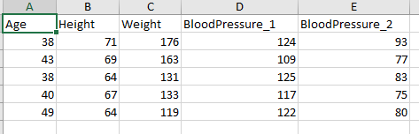

数据标签：

```md
motion_mode: 1 #前进
motion_mode: -1 #后退
motion_mode: 0 #不动
motion_mode: 2 #转弯turn状态
```


# 写入数据

```matl
Age = [38;43;38;40;49];
Height = [71;69;64;67;64];
Weight = [176;163;131;133;119];
BloodPressure = [124 93; 109 77; 125 83; 117 75; 122 80];
T = table(Age,Height,Weight,BloodPressure);
writetable(T,'H:\WenLabData\wormdata\N2_Crawl_202105\Labels\ceshi2.xlsx')
```

Table的形式是这样


写进文件后是这样



如果左边还要加一列的话可以写为:

```matl
Name = {'Smith';'Johnson';'Williams';'Jones';'Brown'};
Age = [38;43;38;40;49];
Height = [71;69;64;67;64];
Weight = [176;163;131;133;119];
BloodPressure = [124 93; 109 77; 125 83; 117 75; 122 80];
T = table(Name,Age,Height,Weight,BloodPressure);
writetable(T,'H:\WenLabData\wormdata\N2_Crawl_202105\Labels\ceshi4.xlsx')
```

得到写入的'xlsx'文件的效果为


