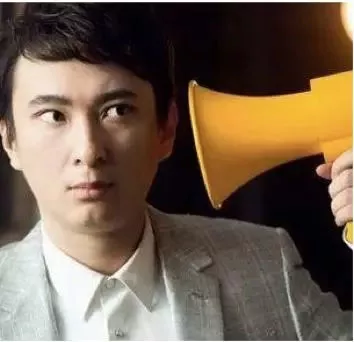
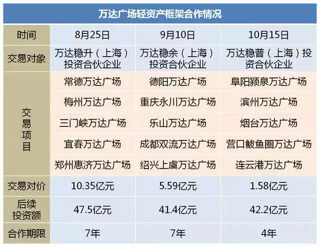
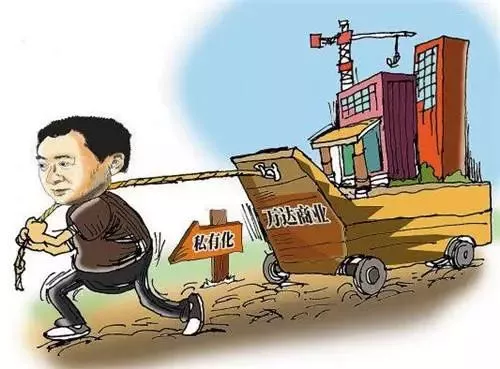
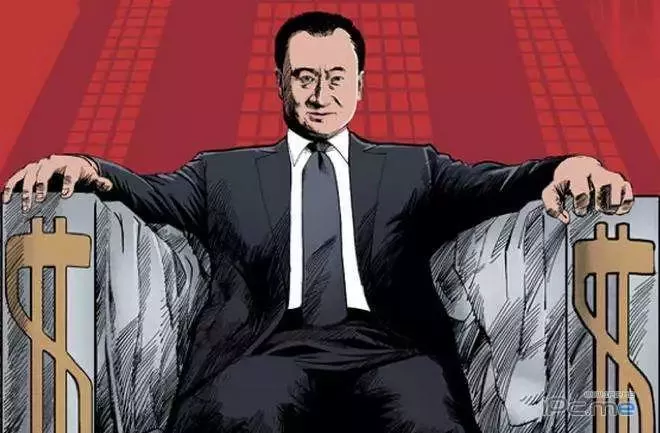
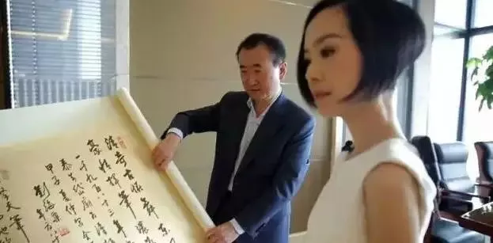
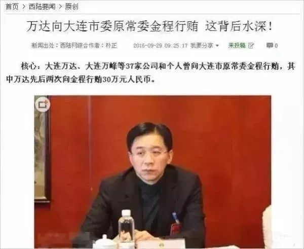
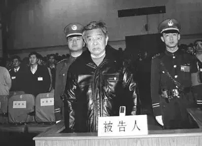
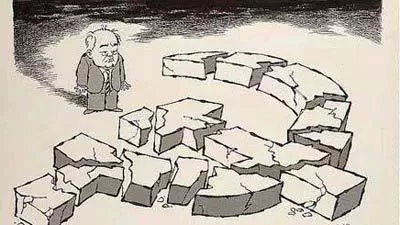

这位大叔国人恐怕没有不知道的

他曾多年被评为中国首富、华人首富、亚洲首富、房地产首富、福布斯前30……

当然最有份量的一个Title

是资产近9000亿（最高峰时）的万达集团董事长

然而很多90后和00后是通过这个小帅哥认识他爹的

<!--more-->

现在这位“二代首富”的知名度已经不亚于他老爸

这个生在黄金窝受到完整西方教育的公子小哥有着他的圈子和场子

他的微博粉丝有数千万之多

09年老王扔给小王5亿练手，小王做了普思投资公司董事长

7年来，5亿翻了12倍成了60亿

成功变身资本家，小王的脾气也见长

说话口气介个味：

埃，谁说我的文凭是买的我跟谁急啊！

老子学习那么努力，成绩特别好!

认识这爷俩也不算啥

您能认识这位气质美女么？

对，她是王老板的原配妻子林宁

也是王公子小帅哥的亲妈

关于这位白富美知道的人很少，传言可不少

明明与王健林一样的红二代背景，有人却说她不姓林

而姓×（还是不传播莫须有的事吧）,是某前中央领导的女儿

这位女神也像他老公和儿子一样，有自己的事业

——林氏投资集团董事长

经营着家装业、餐饮娱乐业、外贸、高端会所等

据说还是全球最大的万达院线的实际控制人

总之在业务上跟老公配合的水乳交融（关联交易）

吃瓜群众对这一家子可能有很多疑惑的问题：

这一家子怎么就坐到了13亿人民的头顶尖上去了？

老王一个“小目标”就是一个亿

小王一开口就是“最不缺的就是钱”

是不是太高调了？容易遭人忌恨？

万达的前身是大连一个区属国有企业

怎么就变成老王的私有企业了？

这个资产转移是肿么完成的？

真像老王说的没有“企业家原罪”吗？

“王大胆”当年怎么完成的“第一桶金”？

2017年网上一直疯传万达粗事了，到底出啥事了？

万达近年一直在“走麦城”

万达全球院线持续亏损

多地万达广场卖给了当地企业

77家五星酒店卖给了富力的李思廉

13家文创产业卖给了融创的孙宏斌…..

万达的资产还要卖多少？

笔者也是带着这些“闹心”的问题来研究王健林的

也希望还群众们一个客观的答案

**万达出事是传言？还是事实？**

2017年，中国房地产业整体进入拐点，万达集团也同步进入拐点。万达多年来的发展一直也是跌跌撞撞过来的，过的沟坎也不少，可是这次真的不一样，貌似有点过不去的节奏。

这一年，乐视是遇到了过不去的坎，万达虽然没有那么明显，瘦死骆驼还在撑着，其实病因与乐视类似。

比如，业务摊子铺的过大，大的与乐视不是一个量级的，而且主要铺的是海外，问题是新铺的业务均处于亏损，且在有限时间内没有扭赢的迹象；

再比如，由于摊子大且亏损，资金链全面紧张，负债率很高，银行催债压力很大，只是由于底盘大，还没到被银行冻结资产的地步。

2016以至2017上半年，万达仍然高调，仍然“昂首阔步”。国内万达广场继续扩张、文旅事业大干快上，老王甚至嘲笑迪斯尼在中国不会赢利，国外除了院线扩张外，还在海外大谈巨型工程项目（马来西亚、印尼）。

2017下半年，风头突然逆转，万达院线股票几个跌停板，跌到被“严重低估”的白菜价。

7月开始，由于资金巨大压力，万达开始狂抛产业，最大的是抛售是13座文旅城和77座酒店。

9月底，国际三大商业评级机构已经把万达降为BB＋的“垃圾级”，海外大项目由于种种原因，明显搁浅。

这些坏消息使万达回归A股的进程受到巨大阻力。

此事万达与投资方是签了对赌协议的：2018年如果万达没有完成IPO，将面临要巨额回购投资人的股份，意味着又一个天价资金缺口！

到年底更有“王炸”文章“王健林的滑铁卢”在网上疯传，抛出4个（每个都让看官惊到合不上嘴）惊天新闻：

万达用两倍价格，欲抢央企在马来西亚的投资项目，引起高层震怒。最后连续抽贷，导致万达被迫割肉卖资产给融创；

万达土地储备从6000万平米，缩减至1000万平米，已掉出一线房企阵营

万达企业管理手段严苛，导致离职率高。猎头公司曝光表示万达员工平均13个月离职，并附上了数据证明。近期原来两位重臣离职；

暗指万达和落网的贪腐官员有密切关联；

这把一向爱看热闹的吃瓜群众们闪懵了，真的？假的？

对于某自媒体的“王炸”文章，万达官网几乎是第一时间答复：对万达集团和王健林本人进行恶意诽谤和中伤，多处严重违背事实，将坚决采取法律手段维护企业名誉。然后是逐条予以驳斥。

对于这些问题我们可以客观地评述：

第一条万达在马来西亚大马城与央企争夺巨额项目是有“影子”的，至于签的是“意向书”还是“正式协议”并未有铁定的证据，后面的引起“高层震怒”也显得有“臆想”的意味；

第二条与第三条是真事的比例很大，很难抹掉；

第四条的水太深，没人能说的清，只能引用当年两会新闻发布会问到敏感问题时发言人用中国人都能懂的、意味深长的答复“你懂的”。

至于卖万达广场、卖酒店、卖文旅城等应该均为事实。卖掉阜阳、滨州、烟台、营口和连云港5座万达广场是万达自己公告的，卖掉77座五星酒店和13座文旅城是有目共睹的。当然，这些都是表面的现象，而万达“走麦城”深层的政治经济背景和原因，确实就难以揣测了。

这就是中国做到这个份上的企业的现实，高处不胜寒，除非某天真的粗事了，才会把真实的“黑幕”逐渐披露出来，否则只能一直是“哥德巴赫猜想”。

对于万达，目前也只能以中国改革开放后的企业发展规律、已出事企业的案例、还有多年前大连党政军一把手被揪出等事实来“反推”。

也用不着去听信“被限制出境”“银行已停止授信”等传言，有些事恐怕王老板自己也不知道会是什么结局？就像老王自己的一句戏言：**如果我明年还能站在这儿讲课，那就说明没事儿喽。**

总之，万达从几年前的异常高调到半年来低调变卖资产以及传言漫天飞绝非“无事”，一定是中国政治经济发展状况在这个企业上的精确反映，当然最终结果确实还没有结论，大家只能拭目以待……

**王健林怎么把国有资产变私有？有没有“原罪”？**

大连万达的前身是大连西岗住宅开发公司，这是一家100%的国有企业，十几年后，在这个公司基础上发展起来的万达一步步变成了100％王健林的私有企业，这一切是怎么发生的？

这与前苏联解体后大量国有企业私有化过程有什么区别吗？

我们先看看事实吧：

**1987年**，大连西岗住宅开发公司成立，这是大连市西岗区区属的一家全民所有制企业；

**1989年，**王健林从大连西岗区政府办公室主任任上辞职，任开发公司总经理；

**1992年，**大连西岗区住宅开发公司改制为大连万达房地产总公司，注册资本1.2亿元，被等额分为12000万股，包括9600万股法人股，以及2400万股个人股。

公司发起股东六家：大连万达房地产总公司持股58.33%，中国工商银行大连信托投资股份有限公司持股12.5%，大连渤海饭店集团公司持股0.83%，大连煤气公司持股3.96%，大连鑫淼实业总公司持股3.96%，大连电业局市内供电局供电技术服务公司持股0.4%，另外20%股份由公司内部职工认购。

**2002年7月31日，**大连万达房地产总公司将持有的万达集团的3000万股股份转让给了**北京合兴投资有限公司**，转让价格为每股1.67元。此外，大连华信信托股份有限公司也将其持有的600万股股份转让给了这家公司，其中100万股的转让价格为每股2.2元，另外500万股的转让价格为每股2元。北京合兴投资有限公司成立于**2001年12月，**公司注册资本为1000万元，大连一方集团有限公司董事长孙双喜以货币方式投入500万元，占总注册资本的50%，王健林和董学林分别以货币方式投入300万元和200万元，占注册资本的30%和20%。

从公司成立到**2007年12月**注销，这期间北京合兴投资有限公司并没有实际业务。这家公司成立的唯一目的，很难说不是为了帮助王健林实现对万达国有股权的收购。

**2004年2月，**大连煤气公司、大连华信信托投资股份有限公司、大连自来水集团给水工程有限公司又陆续将分别持有的475万股、1000万股和475万股万达集团股份转让给了**上海万尚置业有限公司。**

与此同时，大连万达房地产总公司将持有的2050万股转让给万达集团的子公司——大连万达集团房地产企业管理有限公司，形成交叉持股的情形。

仅过了1个月，大连万达房地产总公司继续将持有的900万股转让给了王健林个人，大连万达集团房地产企业管理有限公司则将持有的2050万股中的2000万股转让给上海万尚置业有限公司。

**2004年10月，**大连万达房地产总公司所持有的最后1000万股被转让至上海万尚置业有限公司，彻底从第一发起人的角色中退出。

**上海万尚置业有限公司**成立于2002年12月，在2010年底已经注销。公司注册资本为4000万元，其中90%为王健林个人出资3600万元，另一个股东为开发上海五角场万达广场的上海万达商业广场置业有限公司，出资400万元。上海万尚置业有限公司成立的目的显然也是为了实现王健林对万达集团国有股的收购。

**2004年底，**国有股已经从万达集团全部退出，新的股权结构形成：上海万尚置业有限公司占41.66%，北京合兴投资有限公司占30%，王健林占7.5%，大连万达集团房地产管理有限公司和大连万达房地产有限公司各占0.42%，内部职工占20%。

清退20%的职工持股成为万达集团私有化需要清除的最后一个障碍，根据大连国资委**2005年8月29日**印发的《关于同意大连万达集团股份有限公司清退内部职工股的批复》，万达集团清退2400万股职工股的价格仅为每股2.75元。

在完成私有化后的2年多时间里，万达集团的股权又几经转让，直到**2008年3月，**最终形成了大连合兴投资有限公司持股98%、王健林个人持股2%的持股局面。这个令人眼花缭乱的“资本游戏”不知吃瓜群众看明白没有？

说直白点，92年改制万达公司基本上还是国有企业，王健林个人在员工持股的20%里持总股本的7.5%，到了02年合兴公司期间，王健林个人股份已然变成30%左右，而04年万尚置业期间，王健林个人股份变成80%左右，到08年，万达集团100%股份完全“洗”到了王健林名下！

2012年王健林在清华企业家讲堂上说过，“15年前万达就做了决定，所有公司都不能收取现金，制度上杜绝不行贿。万达是少有的敢公开说我们不行贿的企业。”

2016年10月，在央视鲁豫的节目中，王健林再次强调，万达很清洁，“很多企业有原罪，我们万达没有”。

老王这次“信誓旦旦”话音未落，几天后对大连西岗原区委书记金程的判决书狠狠打了他个“啪啪”，金程在任期间因30多起受贿罪被公诉，其中就有万达高管贿赂的30万元。

**2004年8月到2007年9月间**西岗区政府区长金程多次主持召开区长办公会，决定和研究大连万达房地产总公司转让所持有的大连万达集团股份有限公司全部国有股权事宜，西岗区人民政府2007年9月出函确认对大连万达房地产总公司**1996年至2004年间7000万国有法人股历次转让无异议，**2007年9月完成企业改制。

事后，万达宣布“严惩行贿人员，涉事员工被开除”，而王健林说：员工瞒着我行贿，我真的不知道。这种话谁能信吗？

如果说，万达从100%国有股转为100%个人股的过程令人触目惊心，那么其中起到关键作用的主要是两个人：一是大连一方集团董事长，也曾是北京合兴公司法人孙喜双；

二是大连市前西岗区区长、区委书记金程。

前者是在财务上帮助王健林完成了私有化程序，而后者则是在政治经济上代表政府对整个私有化过程的最终认可与裁定。

这在中国社会是至关重要的一环！

上世纪80年代中期，中国开始改革开放，在那个时代背景下，众多企业家按照自己的理解，利用开放的政策，做出了“五花八门”的企业改制进程。

其中有比较“过线”的被指为“企业家原罪”，像前健力宝集团董事长李经纬、前红塔集团董事长诸时健等均被判有罪；

也有只是打“擦边球”而免罪的案例，如联想的柳传志、万科的王石，仔细琢磨，似乎最重要的区别是后者在改制时没有把股权大头划拉到自己名下，柳传志到最后也就拿了联想2%的股权，王石也就拿了不到1%，由此判定他们是出于公心对国企进行了改制。

**按照这个说法，万达的改制怎么算？**

有几件事我们是不能否认的：

1989年，王健林从区政府办公室主任任上辞职下海，这个魄力和胆识不是大多数政府官员都有的；当年王健林接手西岗开发公司时，那是个连年亏损的烂摊子。

王健林接手后第二年就变成赢利的企业，挣到了第一桶金1000万元。

也就是说，早年的万达从一个没人要的亏损企业变成了赢利的“香饽饽”，王健林的个人贡献肯定是关键性的、无可厚非的。但问题是能否以此为“资本”，在20年内，把100%国企转为100%私企，这个过程是有诸多疑问的。

比如万达几次转股的定价是否合理？是否经过公示？企业资产估值是否合理？是否经过第三方机构的合法认定？价格与估值是否经过国企资产管理机构的认可？是否经过政府部门对私有化程序的合法性（无贪腐状况下）认定？等等，而这些问题在万达的私有化进程中显然是有硬伤的。

前文提到中国企业改制与前苏联解体后大量国有企业私有化过程的区别，笔者认为在上述一些关键点上有惊人相似之处，比如价格？估值？资产管理机构与政府的认定？

差别主要在于国有资产的领域与规模，前苏联国企在领域与规模上全面放开了。

包括重要的能源、交通、钢铁、水泥等基础设施领域，规模上包括特大型国企（中国的央企）；而中国在这些方面是控制住了，但在已开放领域企业私有化过程没有太大区别。

结果是前苏联解体了，经济发展经历了长年的低迷阵痛期，而中国改革避免了阵痛期，中前期异常顺利，只是在后期遇到瓶颈。

可是在开放领域（如房地产），一些私有化企业后来发展规模达到了大型央企的水平，对这些企业私有化的过程如何评估？

2016年10月中央有了最新的说法：中央全面深化改革领导小组通过了《关于完善产权保护制度依法保护产权的意见》，**一锤定音，决定大赦民企历史原罪，为下一步经济改革注入新动力。**

很多人为此唏嘘不止，如果这个政策早日出台，一大批企业家像牟其中、李经纬、黄光裕、褚时健等就不会有牢狱之灾了！

至于万达私有化的问题，老王也不要对“存在原罪”死不认账，事实是清楚的，只是被赦免了而已。

原文链接[https://mp.weixin.qq.com/s/PR3ITMnxEZPZ8dorp1g3FA](https://mp.weixin.qq.com/s/PR3ITMnxEZPZ8dorp1g3FA)