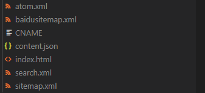
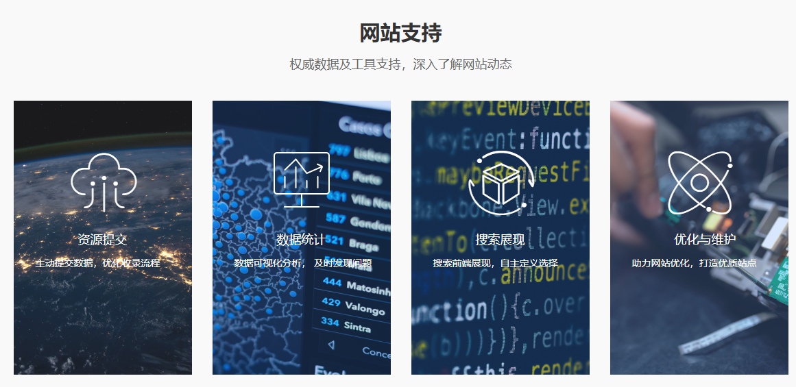
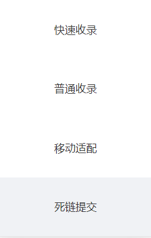
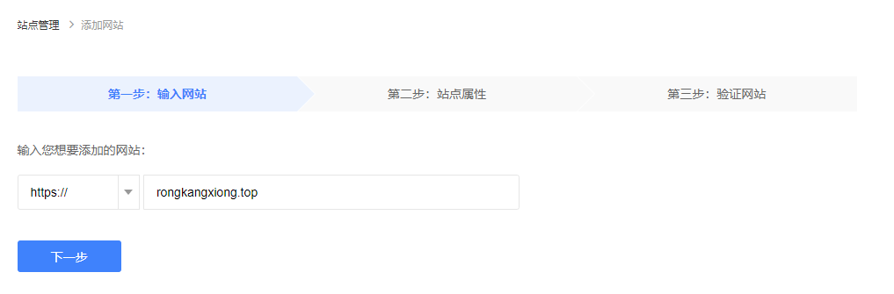
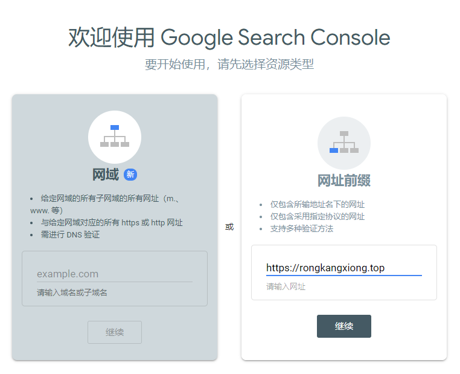
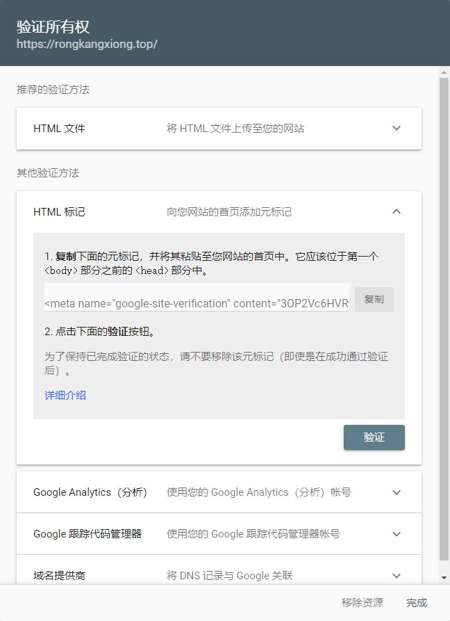

SEO（Search Engine Optimization）：中文译为搜索引擎优化，即利用搜索引擎的规则提高网站搜索引擎内自然排名。主要通过站内优化比如网站结构调整、网站内容建设、网站代码优化等以及站外优化等方式实现。

主要是给各个搜索引擎提交你的 sitemap，让别人能搜到你博客的内容。
先确认博客是否被搜索引擎收录，在百度或者谷歌输入下面格式来判断，如果能搜索到就说明被收录，否则就没有。

```md
site:写你要搜索的域名
# site:xxx.github.io # site:rongkangxiong.top

```

# 开启 Next 主题的 SEO 优化项

Next 提供了 `seo` 优化选项，在主题配置文件`_config.yml`中有个选项是`seo`，设置成`true`即开启了`seo`优化。
百度无法搜索到博客信息，是因为 `Github Pages `屏蔽了百度爬虫

我们需要使用插件自动生成网站的 sitemap，然后将生成的 sitemap 提交到百度和其他搜索引擎。
先安装谷歌和百度的插件，如下：

```npm
npm install hexo-generator-sitemap --save
npm install hexo-generator-baidu-sitemap --save
```

在博客根目录`_config.yml`中改`url`为你的站点地址：

```yam
# URL
## Set your site url here. For example, if you use GitHub Page, set url as 'https://username.github.io/project'
url: https://rongkangxiong.top
permalink: /post/:title.html
permalink_defaults:
pretty_urls:
  trailing_index: true # Set to false to remove trailing 'index.html' from permalinks
  trailing_html: true # Set to false to remove trailing '.html' from permalinks
```

在博客根目录的`_config.yml`中添加如下代码：

```yaml
baidusitemap:
  path: baidusitemap.xml
sitemap:
  path: sitemap.xml
```

之后重新打包`hexo g -d`，若在你的博客根目录的`public`下面发现生成了`sitemap.xml`以及`baidusitemap.xml`就表示成功了



其中`sitemap.xml`文件是搜索引擎通用的文件，`baidusitemap.xml`是百度专用的 `sitemap 文件。可以通过[https://xxx.github.io/baidusitemap.xml](https://xxx.github.io/baidusitemap.xml)查看该文件。

# 向百度提交链接

之后可以将生成的`sitemap`文件提交给百度，可以加快爬虫抓取速度

在[站长平台](https://ziyuan.baidu.com/)，找到 `网站支持-数据引入-链接提交`，选择`自动提交`

一般主动提交比手动提交效果好，这里介绍主动提交的三种方法。从效率上来说：`主动推送>自动推送>sitemap`。







在选择完网站的类型之后需要验证网站的所有权，有三种验证方式，文件验证、html 标签验证、`cname `解析验证。

使用HTML验证最简单

打开 Hexo 主题配置文件，按如下修改/添加：

```yaml
google_site_verification: #索引擎提供给你的HTML标签的content后的内容
baidu_site_verification: #索引擎提供给你的HTML标签content后的内容
```

然后控制台输入`hexo g -d`，部署更新。

验证完之后点击`提交资源`


点击普通收录


安装插件：

```npm
npm install hexo-baidu-url-submit --save
```

根目录配置文件`_config.ym`新增字段：

```yam
baidu_url_submit:
  count: 100 # 提交最新的一个链接
  host: xxx.github.io # 在百度站长平台中注册的域名
  token: xxxxxx # 秘钥，百度站长平台 > 推送接口 > 接口调用地址中token字段
  path: baidu_urls.txt # 文本文档的地址， 新链接会保存在此文本文档里
  xz_appid: xxxxxx # 你的熊掌号 appid
```

其次，记得查看`_config.ym`文件中`url`， 必须是百度站长平台注册的域名（包含www）：

```yam
url: https://rongkangxiong.top
permalink: /post/:title.html
permalink_defaults:
pretty_urls:
  trailing_index: true # Set to false to remove trailing 'index.html' from permalinks
  trailing_html: true # Set to false to remove trailing '.html' from permalinks
```

最后，根目录配置文件新增 deploy：

```yam
deploy:
  type: baidu_url_submitter
```

**注意：参考 [hexo官网](https://hexo.io/docs/deployment.html) 多个 deploy 时要这样写，前面加横杠：**

```yam
# You can use multiple deployers. Hexo will execute each deployer in order.
deploy:
- type: git
  repo:
- type: heroku
  repo:
```

这样以后每次执行`hexo deploy`，链接就会被推送给百度了。


# 让Google收录网站

进入`Google Search Console`控制台 [链接](https://search.google.com/search-console/welcome)



## 验证所有权，有几种验证方法：

```yaml
Domain 网域验证
URL prefix 网址前缀验证，包含以下验证方法：
	HTML file（文件验证）
	HTML taghtml（标签验证）
	Google Analytics
	Google Tag Manager
	Google name provider
```

URL prefix 验证下的，文件验证、标签验证和百度类似，我选的标签验证，在主题配置文件中修改：

```yam
# Google Webmaster tools verification setting
# See: https://www.google.com/webmasters/
google_site_verification: xxxxxxxxxxxxx # 此处改为google提供给你的HTML标签content后的内容
```



## 提交Sitemap


参考链接

​	[Hexo + Next 主题博客提交百度谷歌收录](https://www.luanzhuxian.com/post/82d92ad4.html)


<!--more-->