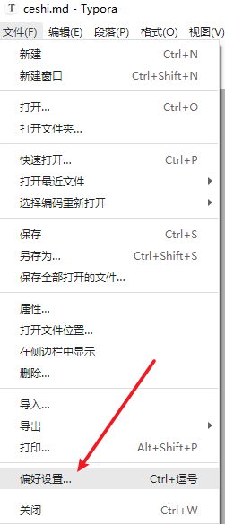
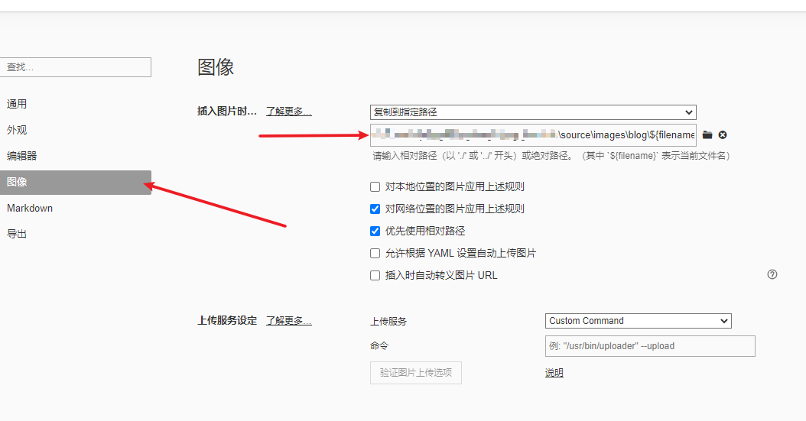
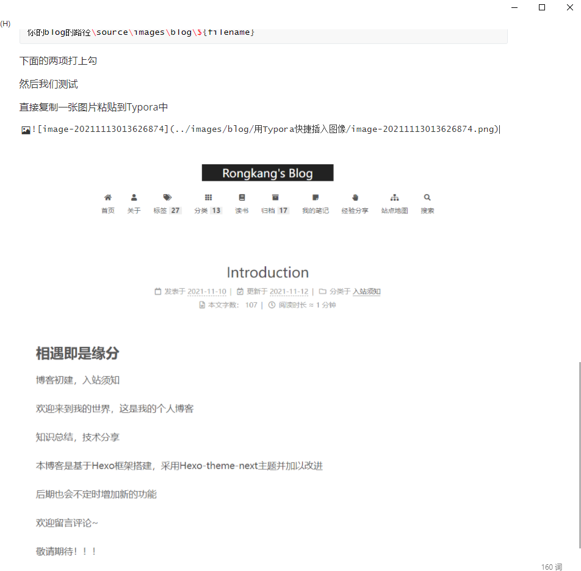
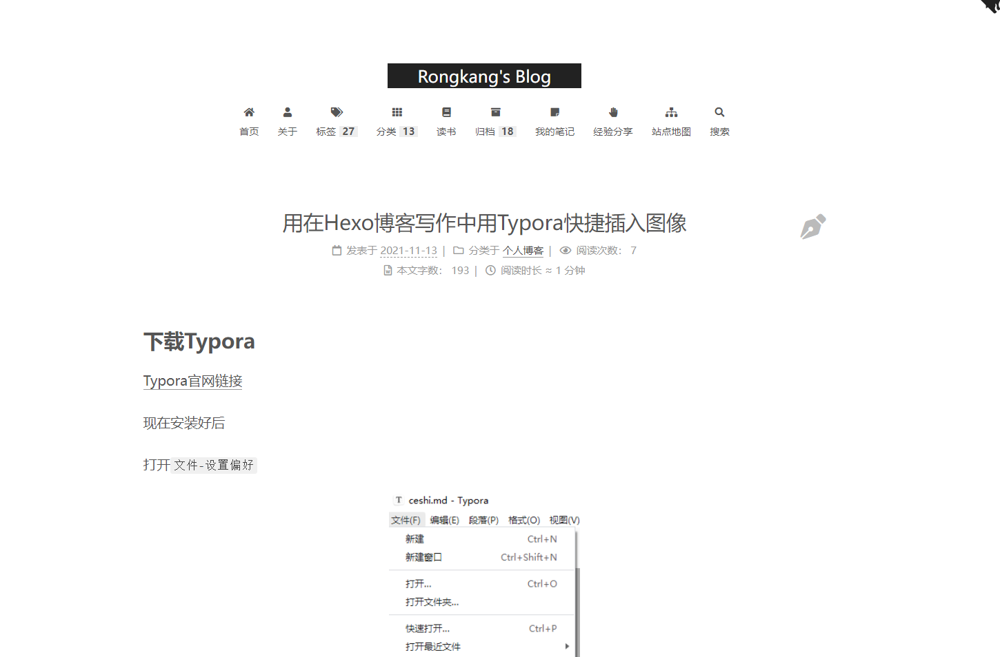

# 下载Typora

[Typora官网链接](https://www.typora.io/)

现在安装好后

打开`文件-设置偏好`

<!--more-->



点击`图像-选择操作 复制到指定路径`




输入一下代码，没有文件夹的可以选择创建文件夹：

```python
你的blog的路径\source\images\blog\${filename}
```

下面的两项打上勾

然后我们测试

直接复制一张图片粘贴到Typora中


效果如图



`Ctrl+s`保存一下`md`文件，然后我们打开网页查看是否有图片

```git
hexo s
```



Nice!

本地编辑器和网页都有了图像

尝试了路径各种排列组合，VScode伤透了我的心，同样的路径格式就是要么VScode有图像，要么网页没图像

最后终于尝试出了一种办法！

