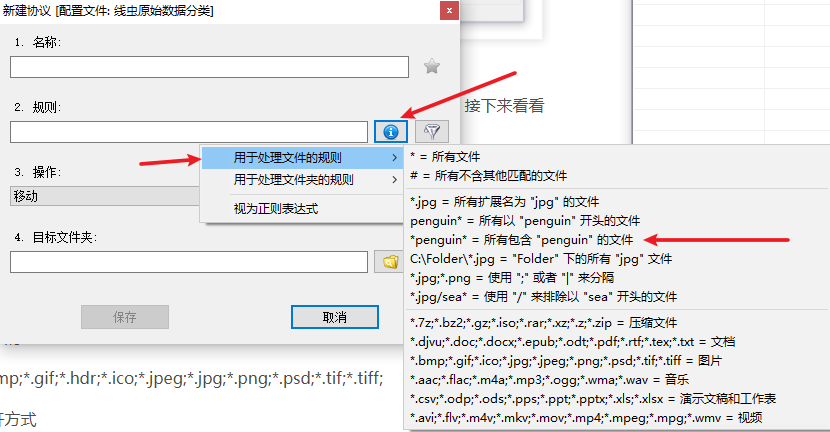
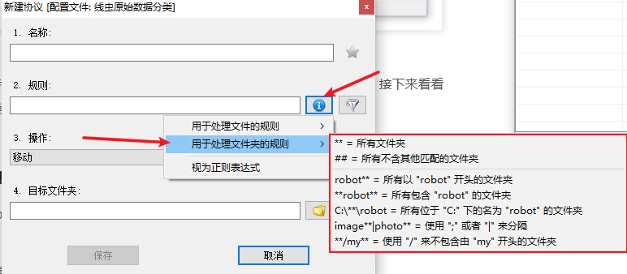
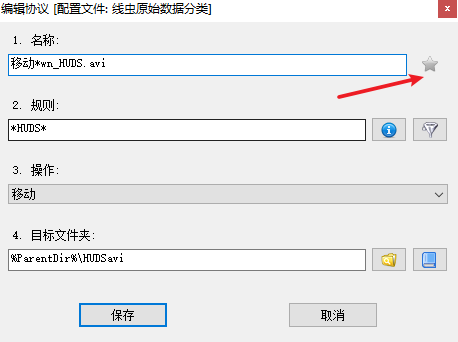
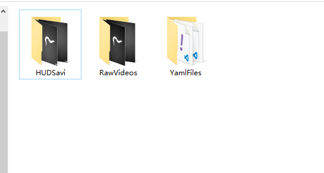

写在前面：

文件管理里有许多琐碎的事要做，比如：
    - 文件自动分组；
    - 批量打包；
    - 批量改格式；
    - 管理安全性高的文件；
    …

如果有一个全自动的文件管理工具，它能够帮你把所有的文件分门别类地放好、给重要的文件加密、还能给文件转格式，会不会迫不及待地想尝试一下？

<!--more-->

[DropIt官网](http://www.dropitproject.com/)

外观可以自由定制

配置规则：选择协议

添加协议

- 处理文件的协议规则

- 处理文件夹的协议规则

- 设定规则优先级

在一个配置文件中可以设定多条协议来筛选文件，但 **多条协议之间可能会产生冲突**，比如设置 `*.jpg` 文件移动到子文件夹，又设置 `*.jpg` 文件放进压缩包。如果运行这个配置文件，它会在扫描文件阶段出现一个提示项，真正执行前让你再做一次选择。简而言之，DropIt 采用的是「一个文件一次应用一条协议」。

可以在配置文件中提高某条协议的优先级（右上角的星号），或是在规则一栏添加 `#` 和 `##` 来区分文件和文件夹，变相提高了协议的优先级

最后配置文件如上，，几十个文件几秒钟就搞定了，效果如下

参考资料：

 [https://sspai.com/post/45532](https://sspai.com/post/45532)
